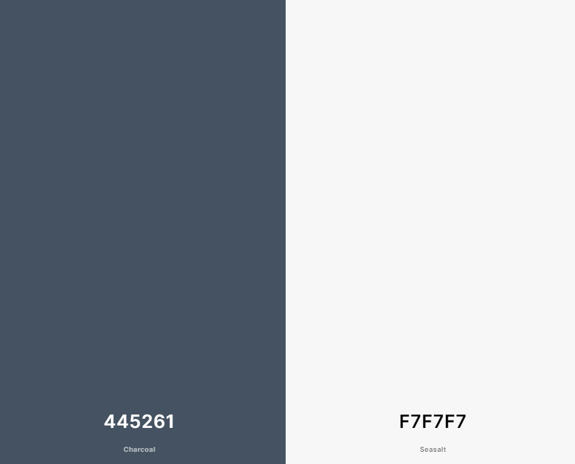
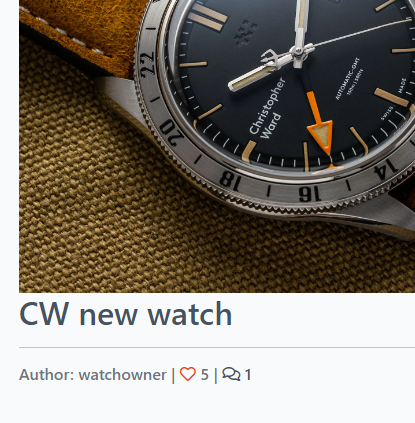
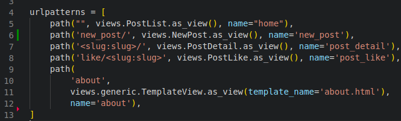
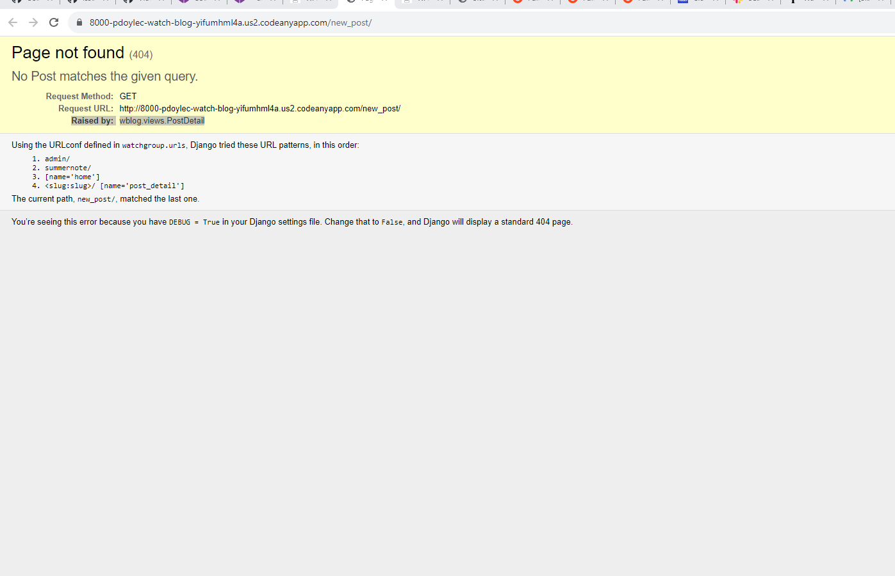

Welcome to the **[Watch Blog](https://watch-blog-1e2436fde037.herokuapp.com/)**

[Link, to live project](https://watch-blog-1e2436fde037.herokuapp.com/)

# **Purpose of the site**
This site is a blog style watch site, aimed at people interested in Watches and new Watches on the market.

# Table of Contents

- [**Purpose of the site**](#purpose-of-the-site)
- [Table of Contents](#table-of-contents)
  - [User Experience](#user-experience)
    - [Agile](#agile)
  - [Users](#users)
  - [Design](#design)
    - [Database schema](#database-schema)
    - [Buttons](#buttons)
- [Features](#features)
- [Languages Used](#languages-used)
- [Django Admin](#django-admin)
- [Testing](#testing)
- [Deployment](#deployment)
- [Issues](#issues)
- [Technologies Used](#technologies-used)
- [Frameworks, Libraries \& Programs Used](#frameworks-libraries--programs-used)
- [Security](#security)
- [Media](#media)
- [Credits](#credits)
  - [Credits to Tutor support](#credits-to-tutor-support)

## User Experience

### Agile

- Agile methodology was used for this project, starting from the planning stage and continuing until the final product. GitHub project was used to stay organized and keep track for the different issues being looked after [Kanban board](https://github.com/users/PdoyleC/projects/4/views/1).
- Agile methodology was used to map and create user stories, each with their own function and list of tasks.
- GitHub projects Kanban was used to keep track of the project. It is divided into To Start, In Progress and Completed. [Link](https://github.com/users/PdoyleC/projects/4/views/1) to Kanban board.

Project Issues Image

## Users

- I wanted the user to go straight to the blog, to see the watches and not to a about page. 
- Users have full CRUD functionality, Create posts, Read post and comments, Update posts they've created and Delete posts they've created.

- The blog is divided into different pages, one page to post an article, one page to send a contact to the site owner, one page to view the blog, and others to sign in and out.
- All users can view the blog. Only authenticated user can create, edit, add comments and deleted posts.

## Design

Wireframes Image

Watch Favicon Image

- the watch logo was created in Publisher, and can be found in the documentation folder.
- Paint was used to design the image.
- favicon was used for website image tab [Link](https://favicon.io/favicon-converter/)
  

### Database schema

Database schema diagram

This was completed using [DrawSQL](https://drawsql.app/)

- The site colours are from the gun metal or charcoal colour of metal. The white ensures readability of the text. 

- Just under the blog image on the home page is the Author, the number of likes and comment icon. The colouring for this font isn't as strand as the Title of the blog, so it doesn't take away for the title name standing out.

### Buttons
- Edit and Delete buttons are coloured so there won't be mixed up. The deleted and the confirm deleted button are red to show the danger and importance on the button.

# Features

NavBar

- The navigation bar designed using Bootstrap and optimized for full responsiveness.
For authenticated users it links to:

- Home Page
- About page
- Write a Post Page
- Logout Page
- Welcome Username display

NavBar Not signed in

For authenticated users it links to:

- Home Page
- About page
- Register Page
- Login Page
  

Footer

- Links to Facebook, Twitter, GitHub, Instagram and YouTube

About Page

-Contains info about the site.

Registration Page

- Where new users are able to create an account to post an article. 

Edit & Delete button

- Where users can Edit and delete a post that they have created, this is only visible if you're the author of the post. 

Delete Confirmation Page

- Just a check to see if the user wants to delete there post.

# Languages Used

- [HTML](https://en.wikipedia.org/wiki/HTML/)
- [CSS](https://en.wikipedia.org/wiki/CSS)
- [JavaScript](https://www.javascript.com/)
- [Python](https://www.python.org/)
- [Django](https://www.djangoproject.com/)

# Django Admin

- The Django admin is a site area that you can use to create, view, update, and delete records.
- In this area the site creator can view contacts, comments and posts.
- The users that have contacted the site are visible in Django admin page, where the messages can be read.

Contact Image from Django Admin 

Post Image from Django Admin

Comment Image from Django Admin

# Testing

Please see [TESTNG.md](TESTNG.md) for all testing completed.

# Deployment

The website uses [ElephantSQL](https://www.elephantsql.com/) for its database.

- I signed up with my GitHub account.
- I created a new instance and the free plan was selected, and Europe was selected as the region.
- Once created I was able to access the  and password for the database.

The website uses [Cloudinary](https://cloudinary.com/) for storing images.

- I created an account in Cloudinary.
- I copied the API environment variable over to the code.

The website was deployed to [Heroku](https://heroku.com/) by following these steps:

- I created a new app/Project.
- Inside the project settings tab and clicked reveal configuration vars
- I added the following configuration vars: CLOUDINARY_URL, DATABASE_URL, PORT, SECRET_KEY - DISABLE_COLLECTSTATIC = Only for initial deployment-
- I went to the deploy tab and connected the GitHub repository
- Made sure DEBUG was set to False and removed DISABLE_COLLECTSTATIC in configuration vars.
- selected Deploy tab and clicked Main branch.
- clicked on Open app.

# Issues

- It seem  that there was an issue with the order of the URL, the new_post url above the post_detail, What was happening was that Django was going through these urls in order, and stopping at the first one that matched the path info. It was solved by moving the new_post url above the post_detail.

URL error

- SummerNote wasn't connecting because of Django clickjacking [Link](https://developer.mozilla.org/en-US/docs/Web/HTTP/Headers/X-Frame-Options).
- I tried to have a Contact Us page on the site, early on in the project but I ran into a problem after trying to run python3 migrate in the terminal. Images below in Error Images wblog_contact. There was an issue saying that there was no contact Us and that it doesn't exist. After contacting tutor assistance, I was told that the database was corrupted and that if it was to be fixed, I would lose everything that I had done. I decided not to go ahead and deleted everything and start the project again.

Error Images wblog_contact

 

- After this I decided that it would be nice if the user could see a video of the watch. After adding the code to views,urls and admin, and then running python3 migrate in the terminal. After this there was an issue with the video blog and it does not exist error, the same issue with the contact page previously. I got in contact with tutor assistance, after chatting with them it was decided to delete that migration file, then run migrate again, I was told that only the posts created in the blog would be deleted and not the whole project. I then realised that the issue with the contact page could have been solved the same way and I misunderstood the term deleted, and it wasn't the whole project that would be deleted. This could have saved a lot of time in me doing research and coding to upload videos. The migration file was deleted and a new superuser was created. New posts were added to the blog.

Error Images wblog_video

 

- After realising that I wouldn't have to delete the whole project, I added the contact page to the site instead of adding videos, as feedback from the users is more valuable to the site. This could have saved me a lot of time working on other areas of the project. 

# Technologies Used

- [HTML5](https://developer.mozilla.org/en-US/docs/Web/HTML)
- [Favicon.io](https://favicon.io/) has been used for the favicon.
- [GitHub](https://github.com/PdoyleC/Watch_Blog) repository has been used for hosting the code.
- [Cloudinary](https://cloudinary.com/) has been used to store media files.
- [Font Awesome](https://fontawesome.com/icons) has been used for icons.
- [ElephantSQL](https://www.elephantsql.com/) has been used as database solution.

# Frameworks, Libraries & Programs Used
- [Cloudinary](https://cloudinary.com/)  used to upload, store, manage, and link images.
- [Django](https://www.djangoproject.com/) is a free Python-based web framework that encourages rapid development with model–template–views.
- [Font Awesome](https://fontawesome.com/) is a font icons toolkit for aesthetic buttons and links.

# Security
- The SECRET_KEY has been changed since the second commit / push to GitHub, and env.py placed into gitignore. 

# Media

- Photos saved in Cloudinary and images taken by me and images from [Pxhere](https://pxhere.com/),[Pexels](https://www.pexels.com/),[Unsplash](https://unsplash.com/).

# Credits

- This website was built by following the walkthrough project Django Blog by Code Institute.
- Django Generic view documentation: [Django Generic view](https://docs.djangoproject.com/en/3.2/topics/class-based-views/generic-display/).
- Django admin site documentation: [Django admin site](https://docs.djangoproject.com/en/3.2/ref/contrib/admin/#django.contrib.admin.ModelAdmin.list_display).
- Django URL dispatcher documentation: [Django URL dispatcher site](https://docs.djangoproject.com/en/3.2/topics/http/urls/#how-django-processes-a-request).
- SummerNote, editor for the Posts: [SummerNote](https://summernote.org/).
- Single sign in for a site: [django-allauth site](https://docs.allauth.org/en/latest/).
- Building a blog application with Django [Django app build](https://djangocentral.com/building-a-blog-application-with-django).
- CSRF, Cross-Site Request Forgery, protection against attackers, [CSRF](https://docs.djangoproject.com/en/3.2/ref/csrf/).
- Django Crispy Forms for built-in template packs, [Crispy Link](https://django-crispy-forms.readthedocs.io/en/latest/index.html).
- Alerts in bootstrap [Alerts](https://getbootstrap.com/docs/5.0/components/alerts/).
- To highlight the current page with an underline, [W3 schools](https://www.w3schools.com/howto/tryit.asp?filename=tryhow_js_active_element2),
[Stack overflow L1](https://stackoverflow.com/questions/72685196/how-to-highlight-the-current-section-the-user-is-viewing-in-javascript),
[Stack overflow L2](https://stackoverflow.com/questions/20410623/how-to-add-active-class-to-html-actionlink-in-asp-net-mvc),
[Stack overflow L3](https://stackoverflow.com/questions/62451903/how-i-can-underline-the-current-page-inside-my-bootstrap-nav),
[Stack overflow L4](https://stackoverflow.com/questions/26819675/navbar-highlight-for-current-page).
- Code for deleting a post was used from [Stackoverflow](https://stackoverflow.com/questions/31843145/deleteview-with-confirmation-template-and-post-method).
- Message Alerts when signed in and out in bootstrap [Message Alerts](https://ordinarycoders.com/blog/article/django-messages-framework).
- Python Django video Tutorial: [Full-Featured Web App](https://www.youtube.com/playlist?list=PL-osiE80TeTtoQCKZ03TU5fNfx2UY6U4p)
- Django Blog Application video Tutorial - [Full Tutorial 2022](https://www.youtube.com/watch?v=I8TRkEcw9Mg)
- Django For Everybody video Tutorial - [Full Python University Course](https://www.youtube.com/watch?v=o0XbHvKxw7Y)
- Build a Social Media App with Django video Tutorial [Python Web Framework Tutorial](https://www.youtube.com/watch?v=xSUm6iMtREA)
- Codemy.com- video Tutorial [Create A Simple Django Blog](https://www.youtube.com/watch?v=B40bteAMM_M&list=PLCC34OHNcOtr025c1kHSPrnP18YPB-NFi)
- Codemy.com- video Tutorial [Stack overflow](https://stackoverflow.com/questions/534839/how-to-create-a-guid-uuid-in-python)
- Developer- Running tests for Django [developer](https://developer.mozilla.org/en-US/docs/Learn/Server-side/Django/Testing#how_to_run_the_tests)
- Django project- new_post.html - stops direct link to new post being used and creating post with no login. [djangoproject](https://docs.djangoproject.com/en/4.2/topics/auth/default/)

## Credits to Tutor support

- The following tutors online at CI, guided and helped me during this project - Osin, John, Rebecca, Martin, Gemma, Joanne, jason, Kevin, Sean.
- My mentor Rory Patrick Sheridan for good briefings, tips and feedback.
