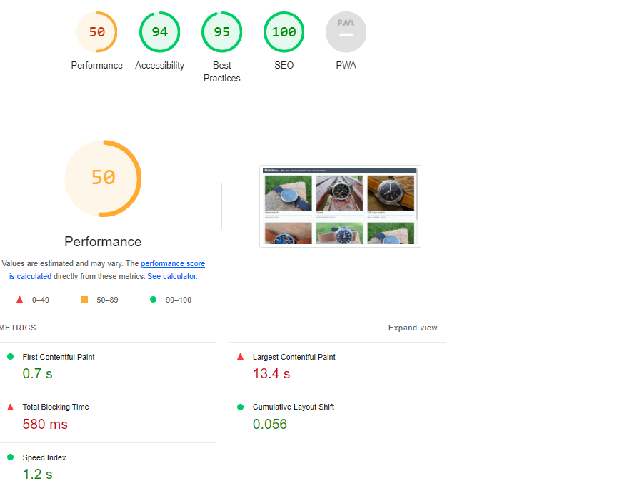

# Welcome to the **[Watch Blog](https://watch-blog-1e2436fde037.herokuapp.com/)**

## [Link, to live project](https://watch-blog-1e2436fde037.herokuapp.com/)

## **Purpose of the site**
This site is a blog style watch site, aimed at people interested in Watches and new Watches on the market.

## User Experience

### Agile

- Agile methodology was used for this project, starting from the planning stage and continuing until the final product. GitHub project was used to stay organized and keep track for the different issues being looked after [Kanban board](https://github.com/users/PdoyleC/projects/4/views/1).
- Agile methodology was used to map and create user stories, each with there own fuction and list of tasks. 
- GitHub projects Kanban was used to keep track of the project. It is divided into To Start, In Progress and Completed. [Link](https://github.com/users/PdoyleC/projects/4/views/1) to Kanban board.

Project Issues Image

### Users

- I wanted the user to go straight to the blog, to see the watches and not to a about page. 
- Users have full CRUD functionality, Create posts, Read post and comments, Update posts they've created and Delete posts they've created.
- There're comments and likes feature also for each post, so users can interact with the blog.

### Wireframe/Structure

- The blog is divided into different pages, one page to post an article, one page to send a contact to the site owner, one page to view the blog, and others to sign in and out.
- Wireframes were made using [balsamiq wireframes](https://balsamiq.com/wireframes/)
- All users can view the blog. Only authenticated user can create, edit, add comments and deleted posts.

Wireframes Image

## Design

Watch Favicon Image

- the watch logo was created in Publisher, and can be found in the documentation folder. 
- Paint was used to design the image.
- favicon was used for website image tab [Link](https://favicon.io/favicon-converter/)
  

Database schema diagram

This was completed using [DrawSQL](https://drawsql.app/)

### Buttons
- Edit and Delete buttons are coloured so there won't be mixed up. The deleted and the confirm deleted button are red to show the danger and importance on the button.

## Features

NavBar

- The navigation bar designed using Bootstrap and optimized for full responsiveness.
For authenticated users it links to:

- Home Page
- About page
- Write a Post Page
- Logout Page
- Welcome User Name display

NavBar Not signed in

For authenticated users it links to:

- Home Page
- About page
- Register Page
- Login Page
  

Footer

- Links to facebook, Twitter, GitHub, Instragram and Youtube

About Page

-Contains info about the site.

Registration Page

- Where new users are able to create an account to post an article. 

Edit & Delete button

- Where users can Edit and delete a post that they have created, this is only visible if your the author of the post. 

Delete Confirmation Page

- Just a check to see if the user wants to delete there post.

## Languages Used

- [HTML](https://en.wikipedia.org/wiki/HTML/)
- [CSS](https://en.wikipedia.org/wiki/CSS)
- [JavaScript](https://www.javascript.com/)
- [Python](https://www.python.org/)
- [Django](https://www.djangoproject.com/)

## Testing

Validator Testing

#### HTML

Validator: [W3C Validator](https://validator.w3.org/).

- No errors or warnings to show for during the W3C Validator testing.

| Page     | Validator                                                                                                    | Result |
| -------- | ------------------------------------------------------------------------------------------------------------ | ------ |
| Blog     | 

Blog

                   |  PASS  |
| Blog Post| 

Blog Post

                   |  PASS  |
| Login    | 

Login

                         |  PASS  |
| Logout   | 

Logout

                  |  PASS  |
| Create   | 

Create

            |  PASS  |
| Contact  | 

Contact

          |  PASS  |
| Register | 

Register

            |  PASS  |

W3C Validator Images

#### CSS

Validator: [Jigsaw Validator](https://jigsaw.w3.org/css-validator/validator).

CSS Validation Image

#### Python 

Validator: [CI Python Linter](https://pep8ci.herokuapp.com/).

| File     | Validator                                                                                         | Result |
| -------- | ------------------------------------------------------------------------------------------------- | ------ |
| Models   | 

Models

      |  PASS  |
| Views    | 

Views

       |  PASS  |
| Forms    | 

Forms

       |  PASS  |
| Urls     | 

Urls

           |  PASS  |
| Admin    | 

Admin

       |  PASS  |
| Settings | 

Settings

 |  PASS  |

Settings.py validation errors of line to long are from the original django configuration set up and are left for readability.

### JavaScript

Validator: [JSHint Validator](https://jshint.com/).

JS Validation Image

Manual Testing

**User Registered**
- There are some features that are only visible when the user is logged in.
- User can create a post.
- User can edit there own post they created.
- User can leave a comment.
- User can delete there own post they created
  
**User Not Registered**

- If there is no user logged in, The home page won't show Crate a post.
- The user will be able to see a post entry but won't be able to add a comment.
- The user isn't able to edit or deleted a post unless its a post that the user has created.

Login and Not Logged in Page

**User Registered**

- If a user is registered, they will be able to create a post.
- If the user has created a post, that user will be able to edit and deleted there own post.
- If the user isn't the creator of the post the user can't edit or deleted the post, only add coments.
- Alert messages appear when a use has logged in, logged out, a comment added, a post is edited and a when a post is deleted.

**Image display**
- Code was added to the default image in index.html and alt text appear instead of the image. There is a comparison in the image below.

Image error

## Django

- The Django admin is a site area that you can use to create, view, update, and delete records.
- In this area the site creator can view contacts,comments,posts.
- The users that have contacted the site are visible in Django admin page.

Contact Image from Djanjo Admin 

Post Image from Djanjo Admin

Comment Image from Djanjo Admin

**Checks Completed**
- The following check have been conpleted
  

|Test|       Action                             |   Result                                                                  |Done   |
|----|------------------------------------------|---------------------------------------------------------------------------|-------|
| 1  |  Login is Clicked                        |  Redirected to login page                                                 | PASS  |
| 2  |  Watch Blog logo clicked on about page   |  Redirected to home page                                                  | PASS  |
| 3  |  Register is Clicked	                    |  Redirected to Sign up page                                               | PASS  |
| 4  |  Login is Clicked	                    |  Signed in and redirected to Blog home page                               | PASS  |
| 5  |  Logout is clicked 	                    |  Redirected to Sign out page, sign out clicked, and sign out              | PASS  |
| 6  |  Home page clicked post entry	        |  Directed to post entry.                                                  | PASS  |
| 7  |  Bolg Post edit/delete post	            |  

Not correct user, can't edit or delert post

                              | PASS  |
| 8  |  Create a Post	                        |  Redirected to create a post page                                         | PASS  |
| 9  |  Create a Post page	                    |  No title entered, post button clicked, error field appears               | PASS  |
| 10 |  Create a Post page	                    |  No Contect entered, post button clicked, error field appears             | PASS  |
| 11 |  Create a Post page	                    |  No image entered, post button clicked,default image  appears in blog     | PASS  |
| 12 |  Bolg Post edit, creator	                |  

Edit button visible

                                                      | PASS  |
| 13 |  Bolg Post delete, creator	            |  

Delete button visible

                                                    | PASS  |
| 14 |  Delete button clicked	                |  Confirmation button appears                                              | PASS  |
| 15 |  Blog home page, comment icon clicked.	|  Redirect to blog post                                                    | PASS  |
| 16 |  Comment icon	                        |  Correct number on blog page and home page                                | PASS  |
| 17 |  Like heart button clicked on blog page	|  Increments number by 1                                                   | PASS  |
| 18 |  heart icon	                            |  Correct number on blog page and home page                                | PASS  |
| 19 |  Footer, clicking facebook icon	        |  

Redirected to facebook

                                                   | PASS  |
| 20 |  Footer, clicking Twitter (x) icon	    |  

Redirected to Twitter

                                                | PASS  |
| 21 |  Footer, clicking Github icon	        |  

Redirected to Github

                                                     | PASS  |
| 22 |  Footer, clicking Instagram icon	        |  

Redirected to Instagram

                                                  | PASS  |
| 23 |  Footer, clicking Youtube icon	        |  

Redirected to Youtube

                                                 | PASS  |
| 24 |  Message alert for Signed in	            |  

Alert Appears

                                                            | PASS  |
| 25 |  Message alert for Signed out	        |  

Alert Appears

                                                            | PASS  |
| 26 |  Message alert for post edited	        |  

Alert Appears

                                                            | PASS  |
| 27 |  Message alert for post deleted	        |  

Alert Appears

                                                            | PASS  |
| 28 |  Message alert for comment added	        |  

Alert Appears

                                                            | PASS  |
| 29 |  Next and Prev buttons	                |  Direct to next and Prevous pages                                         | PASS  |

|Test|     Post Detail Page                     |   Result                                                                  |Done   |
|----|------------------------------------------|---------------------------------------------------------------------------|-------|
| 1  |  Edit button                             | Visable for authenticated user of post                                    | PASS  |
| 2  |  Edit button                             | Isn't Visable for unauthenticated user of post                            | PASS  |
| 3  |  Deleted button	                        | Visable for authenticated user of post                                    | PASS  |
| 4  |  Deleted button	                        | Isn't Visable for unauthenticated user of post                            | PASS  |
| 5  |  Add comment button 	                    | Visable for authenticated user of the site                                | PASS  |

|Test|     Sign Up page                         |   Result                                                                  |Done   |
|----|------------------------------------------|---------------------------------------------------------------------------|-------|
| 1  |  Valid info, submitted                   | Redirected to blog                                                        | PASS  |
| 2  |  Invalid info, submitted                 | Error message appears                                                     | PASS  |
| 3  |  Sign Up button	                        | Hover over, colour changes                                                | PASS  |
| 4  |  Sign Up button clicked	                | Signed up and redirected to Blog home page                                | PASS  |

|Test|     Contact Page                         |   Result                                                                  |Done   |
|----|------------------------------------------|---------------------------------------------------------------------------|-------|
| 1  |  Submint button                          | Hover over, colour changes                                                | PASS  |
| 2  |  Submint button clicked                  | Message sends, Alert message appears                                      | PASS  |
| 3  |  Submint button clicked                  | Djanjo admin app is updated with contact name, email and message          | PASS  |

|Test|     Logout Page                          |   Result                                                                  |Done   |
|----|------------------------------------------|---------------------------------------------------------------------------|-------|
| 1  |  Sign Out button                         | Hover over, colour changes                                                | PASS  |
| 2  |  Sign Up button clicked                  | Redirected to Blog home page, Alert message appears                       | PASS  |

|Test|     Logout Page                          |   Result                                                                  |Done   |
|----|------------------------------------------|---------------------------------------------------------------------------|-------|
| 1  |  Sign In button                          | Hover over, colour changes                                                | PASS  |
| 2  |  Sign Up link clicked                    | Redirected to Sign Up page                                                | PASS  |
| 3  |  Invalid Username/Password	            | Asked to enter correct username                                           | PASS  |

|Test|     Create Post Page                     |   Result                                                                  |Done   |
|----|------------------------------------------|---------------------------------------------------------------------------|-------|
| 1  |  Link to Go Back pressed                 | Redirected to Blog/Home page                                              | PASS  |
| 2  |  Link to Go Back pressed                 | Redirected to Blog/Home page                                              | PASS  |

## WAVE

- I used [WAVE](https://wave.webaim.org/)  (Web Accessibility Evaluation Tool) in chrome developer tools to test the website accessibility. WAVE is a tool that identifies ways to make a webpage more accessible to people with disabilities. WAVE scans the website for on-page and technical accessibility issues and errors to bring the site in line with recognized accessibility standards, like the Web Content Accessibility Guidelines (WCAG).

Wave Testing Image

## Lighthouse

* Lighthouse in chrome developer tool, was used to test the website for:
* Performance - how the page performs whilst loading.
* Accessibility - how accessible is the site for all users and how can it be improved.
* Best practices - how does the site conform to industry best practices.
* SEO - search engine optimization. Is the site optimized for search engine result rankings.

- Performance is down to the images and there size.

Lighthouse Testing Image

Automated Testing

- Some code was written for automated testing, more research and learning needs to go into this so I can learn how to code the tests and improve the auto testing function. 

Browsers compatibility 

The website has been tested in the following browsers on desktop:

Chrome Test 

Fire Fox Test 

Edge Test 

## Deplyoment

The website uses [ElephantSQL](https://www.elephantsql.com/) for its database.

- I signed up with my GitHub account.
- I created a new instance and the free plan was selected and Europe was selected as the region.
- Once created I was able to access the url and password for the database.

The website uses [Cloudinary](https://cloudinary.com/) for storing images.

- I created an account in Cloudinary.
- I copied the API environment variable over to the code.

The website was deployed to [Heroku](https://heroku.com/) by following these steps:

- I created a new app/Project.
- Inside the project settings tab and clicked reveal configuration vars
- I added the following configuration vars: CLOUDINARY_URL, DATABASE_URL, PORT, SECRET_KEY - DISABLE_COLLECTSTATIC = Only for initial deployment-
- I went to the deploy tab and connected the GitHub repository
- Made sure DEBUG was set to False and removed DISABLE_COLLECTSTATIC in configuration vars.
- selected Deploy tab and clicked Main branch.
- clicked on Open app.

## Issues

- SummerNote wasn't connecting because of Django clickjacking [Link](https://developer.mozilla.org/en-US/docs/Web/HTTP/Headers/X-Frame-Options).
- I tried to have a Contact Us page on the site, early on in the project but I ran into a problem after trying to run python3 migrate in the terminal. <mark>Images below in Error Images wblog_contact </mark>. There was an issue saying that there was no contact Us and that it doesn't exist. After contacting tutor assistance I was told that the datadase was corrupted and that if it was to be fixed I would lose everthing that I had done. I decided not to go ahead and deleted everything and start the project again.

Error Images wblog_contact

 

- After this I decided that it would be nice if the user could see a video of the watch. After adding the code to views,urls,admin and then running python3 migrate in the terminal. After this there was an issue with the video blog and it does not exist error, the same issue with the contact page previously. I got in contact with tutor assistance, after chatting with them it was decided to delete that migration file, then run migrate again, I was told that only the posts created in the blog would be deleted and not the whole project. I then realised that the issue with the contact page could have been solved the same way and I misunderstood the term deleted, and it wasn't the whole project that would be deleted. This could have saved a lot of time in me doing research and coding to upload videos. The mirgration file was deleted and a new superuser was created. New posts were added to the blog.

Error Images wblog_video

 

- After realising that I wouldn't have to deleted the whole project, I added the contact page to the site instead of adding videos, as feedback from the users is more valuable to the site. This could have saved me a lot of time working on other areas of the project. 

## Technologies Used

- [HTML5](https://developer.mozilla.org/en-US/docs/Web/HTML)
- [Favicon.io](https://favicon.io/) has been used for the favicon.
- [GitHub](https://github.com/PdoyleC/Watch_Blog) repository has been used for hosting the code.
- Cloudinary has been used to store media files.
- [Font Awesome](https://fontawesome.com/icons) has been used for icons.
- ElephantSQL has been used as database solution.

### Frameworks, Libraries & Programs Used
- [Cloudinary](https://cloudinary.com/)  used to upload, store, manage, and link images.
- [Django](https://www.djangoproject.com/) is a free Python-based web framework that encourages rapid development with model–template–views.
- [Font Awesome](https://fontawesome.com/) is a font icons toolkit for aesthetic buttons and links.

## Security
- The SECRET_KEY has been changed since the second commit / push to GitHut, and env.py placed into gitignore. 

## Credits

- Photos saved in Cloudinary and images taken by myself and images from [Pxhere](https://pxhere.com/),[Pexels](https://www.pexels.com/),[Unsplash](https://unsplash.com/).

## Credits

- This website was built by following the walkthrough project Django Blog by Code Institute.
- Dj-ango Generic view documentation: [Django Generic view](https://docs.djangoproject.com/en/3.2/topics/class-based-views/generic-display/).
- Django admin site documentation: [Django admin site](https://docs.djangoproject.com/en/3.2/ref/contrib/admin/#django.contrib.admin.ModelAdmin.list_display).
- Django URL dispatcher documentation: [Django URL dispatcher site](https://docs.djangoproject.com/en/3.2/topics/http/urls/#how-django-processes-a-request).
- SummerNote, editor for the Posts: [SummerNote](https://summernote.org/).
- Single sign in for a site: [django-allauth site](https://docs.allauth.org/en/latest/).
- Building a blog application with Django [Django app build](https://djangocentral.com/building-a-blog-application-with-django).
- CSRF, Cross-Site Request Forgery, protection against attackers, [CSRF](https://docs.djangoproject.com/en/3.2/ref/csrf/).
- Django Crispy Forms for built-in template packs, [Crispy Link](https://django-crispy-forms.readthedocs.io/en/latest/index.html).
- Alerts in bootstrap [Alerts](https://getbootstrap.com/docs/5.0/components/alerts/).
- To highlight the current page with an underline, [W3 schools](https://www.w3schools.com/howto/tryit.asp?filename=tryhow_js_active_element2),
[Stack overflow L1](https://stackoverflow.com/questions/72685196/how-to-highlight-the-current-section-the-user-is-viewing-in-javascript),
[Stack overflow L2](https://stackoverflow.com/questions/20410623/how-to-add-active-class-to-html-actionlink-in-asp-net-mvc),
[Stack overflow L3](https://stackoverflow.com/questions/62451903/how-i-can-underline-the-current-page-inside-my-bootstrap-nav),
[Stack overflow L4](https://stackoverflow.com/questions/26819675/navbar-highlight-for-current-page).
- Code for deleting a post was used from [Stackoverflow](https://stackoverflow.com/questions/31843145/deleteview-with-confirmation-template-and-post-method).
- Message Alerts when signed in and out in bootstrap [Message Alerts](https://ordinarycoders.com/blog/article/django-messages-framework).
- Python Django video Tutorial: [Full-Featured Web App](https://www.youtube.com/playlist?list=PL-osiE80TeTtoQCKZ03TU5fNfx2UY6U4p)
- Django Blog Application video Tutorial - [Full Tutorial 2022](https://www.youtube.com/watch?v=I8TRkEcw9Mg)
- Django For Everybody video Tutorial - [Full Python University Course](https://www.youtube.com/watch?v=o0XbHvKxw7Y)
- Build a Social Media App with Django video Tutorial [Python Web Framework Tutorial](https://www.youtube.com/watch?v=xSUm6iMtREA)
- Codemy.com- video Tutorial [Create A Simple Django Blog](https://www.youtube.com/watch?v=B40bteAMM_M&list=PLCC34OHNcOtr025c1kHSPrnP18YPB-NFi)
- Codemy.com- video Tutorial [Stack overflow](https://stackoverflow.com/questions/534839/how-to-create-a-guid-uuid-in-python)

<https://stackoverflow.com/questions/534839/how-to-create-a-guid-uuid-in-python>

## Credits to Tutor support

- The following tutors online at CI, guided and helped me during this project - Osin, John, Rebecca, Martin, Gemma, Joanne, jason, Kevin, Sean.
