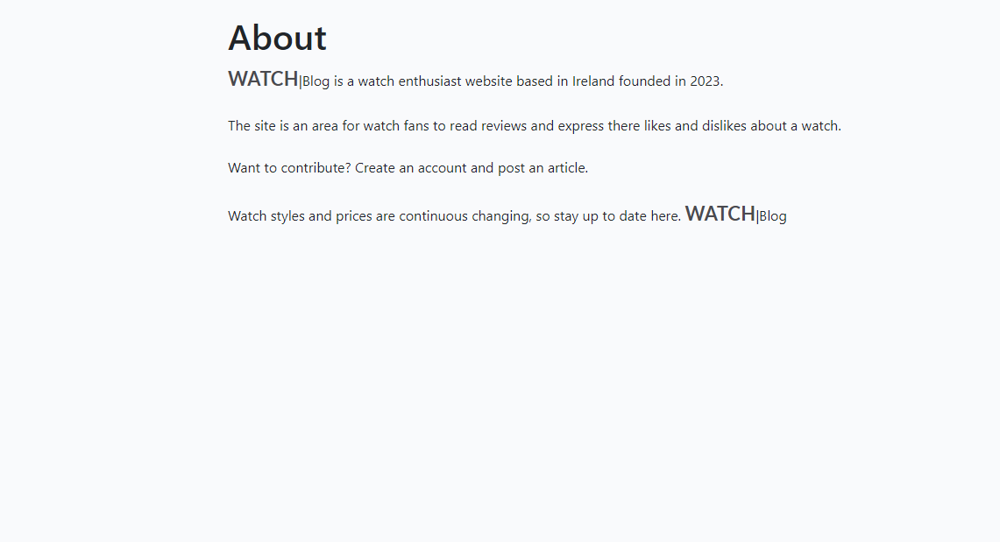
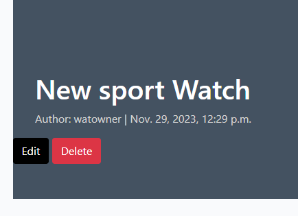

# Welcome to the **[Watch Blog](https://watch-blog-1e2436fde037.herokuapp.com/)**

## [Link, to live project](https://watch-blog-1e2436fde037.herokuapp.com/)

## **Purpose of the site**

This site is a blog style watch site, aimed at people interested in Watches and new Watches on the market.

## Design

Watch Favicon Image

- the watch logo was created in Publisher, and can be found in the documentation folder. 
- Paint was used to design the image.
- favicon was used for website image tab [Link](https://favicon.io/favicon-converter/)
  

Database schema diagram

This was completed using [DrawSQL](https://drawsql.app/)

## Features

NavBar

For authenticated users it links to:

- Home Page
- About page
- Write a Post Page
- Logout Page
- Welcome User Name display

NavBar Not signed in

For authenticated users it links to:

- Home Page
- About page
- Register Page
- Login Page
  

Footer

- Links to facebook, Twitter, GitHub, Instragram and Youtube

About Page

-Contains info about the site.

Registration Page

- Where new users are able to create an account to post an article. 

Edit & Delete button

- Where users can Edit and delete a post that they have created, this is only visible if your the author of the post. 

Delete Confirmation Page

- Just a check to see if the user wants to delete there post.

## Languages Used

- [HTML](https://en.wikipedia.org/wiki/HTML/)
- [CSS](https://en.wikipedia.org/wiki/CSS)
- [JavaScript](https://www.javascript.com/)
- [Python](https://www.python.org/)
- [Django](https://www.djangoproject.com/)

## Deplyoment

The website uses [ElephantSQL](https://www.elephantsql.com/) for its database.

- I signed up with my GitHub account.
- I created a new instance and the free plan was selected and Europe was selected as the region.
- Once created I was able to access the url and password for the database.

The website uses [Cloudinary](https://cloudinary.com/) for storing images.

- I created an account in Cloudinary.
- I copied the API environment variable over to the code.

The website was deployed to [Heroku](https://heroku.com/) by following these steps:

- I created a new app/Project.
- Inside the project settings tab and clicked reveal configuration vars
- I added the following configuration vars: CLOUDINARY_URL, DATABASE_URL, PORT, SECRET_KEY - DISABLE_COLLECTSTATIC = Only for initial deployment-
- I went to the deploy tab and connected the GitHub repository
- Made sure DEBUG was set to False and removed DISABLE_COLLECTSTATIC in configuration vars.
- selected Deploy tab and clicked Main branch.
- clicked on Open app.

## Issues

- SummerNote wasn't connecting because of Django clickjacking [Link](https://developer.mozilla.org/en-US/docs/Web/HTTP/Headers/X-Frame-Options).
- 

## Technologies Used

- [HTML5](https://developer.mozilla.org/en-US/docs/Web/HTML)
- [Favicon.io](https://favicon.io/) has been used for the favicon.
- [GitHub](https://github.com/PdoyleC/Watch_Blog) repository has been used for hosting the code.
- Cloudinary has been used to store media files.
- [Font Awesome](https://fontawesome.com/icons) has been used for icons.
- ElephantSQL has been used as database solution.

### Frameworks, Libraries & Programs Used
- [Cloudinary](https://cloudinary.com/)  used to upload, store, manage, and link images.
- [Django](https://www.djangoproject.com/) is a free Python-based web framework that encourages rapid development with model–template–views.
- [Font Awesome](https://fontawesome.com/) is a font icons toolkit for aesthetic buttons and links.

## Security
- The SECRET_KEY has been changed since the second commit / push to GitHut, and env.py placed into gitignore. 

## Credits

- Photos saved in Cloudinary and images taken by myself and images from [Pxhere](https://pxhere.com/),[Pexels](https://www.pexels.com/),[Unsplash](https://unsplash.com/).

## Credits

- This website was built by following the walkthrough project Django Blog by Code Institute.
- Dj-ango Generic view documentation: [Django Generic view](https://docs.djangoproject.com/en/3.2/topics/class-based-views/generic-display/).
- Django admin site documentation: [Django admin site](https://docs.djangoproject.com/en/3.2/ref/contrib/admin/#django.contrib.admin.ModelAdmin.list_display).
- Django URL dispatcher documentation: [Django URL dispatcher site](https://docs.djangoproject.com/en/3.2/topics/http/urls/#how-django-processes-a-request).
- SummerNote, editor for the Posts: [SummerNote](https://summernote.org/).
- Single sign in for a site: [django-allauth site](https://docs.allauth.org/en/latest/).
- Building a blog application with Django [Django app build](https://djangocentral.com/building-a-blog-application-with-django).
- CSRF, Cross-Site Request Forgery, protection against attackers, [CSRF](https://docs.djangoproject.com/en/3.2/ref/csrf/).
- Django Crispy Forms for built-in template packs, [Crispy Link](https://django-crispy-forms.readthedocs.io/en/latest/index.html).
- Alerts in bootstrap [Alerts](https://getbootstrap.com/docs/5.0/components/alerts/).
- To highlight the current page with an underline, [W3 schools](https://www.w3schools.com/howto/tryit.asp?filename=tryhow_js_active_element2),
[Stack overflow L1](https://stackoverflow.com/questions/72685196/how-to-highlight-the-current-section-the-user-is-viewing-in-javascript),
[Stack overflow L2](https://stackoverflow.com/questions/20410623/how-to-add-active-class-to-html-actionlink-in-asp-net-mvc),
[Stack overflow L3](https://stackoverflow.com/questions/62451903/how-i-can-underline-the-current-page-inside-my-bootstrap-nav),
[Stack overflow L4](https://stackoverflow.com/questions/26819675/navbar-highlight-for-current-page).
- Code for deleting a post was used from [Stackoverflow](https://stackoverflow.com/questions/31843145/deleteview-with-confirmation-template-and-post-method).
- Message Alerts when signed in and out in bootstrap [Message Alerts](https://ordinarycoders.com/blog/article/django-messages-framework).
- Python Django video Tutorial: [Full-Featured Web App](https://www.youtube.com/playlist?list=PL-osiE80TeTtoQCKZ03TU5fNfx2UY6U4p)
- Django Blog Application video Tutorial - [Full Tutorial 2022](https://www.youtube.com/watch?v=I8TRkEcw9Mg)
- Django For Everybody video Tutorial - [Full Python University Course](https://www.youtube.com/watch?v=o0XbHvKxw7Y)
- Build a Social Media App with Django video Tutorial [Python Web Framework Tutorial](https://www.youtube.com/watch?v=xSUm6iMtREA)
- Codemy.com- video Tutorial [Create A Simple Django Blog](https://www.youtube.com/watch?v=B40bteAMM_M&list=PLCC34OHNcOtr025c1kHSPrnP18YPB-NFi)
- Codemy.com- video Tutorial [Stack overflow](https://stackoverflow.com/questions/534839/how-to-create-a-guid-uuid-in-python)

<https://stackoverflow.com/questions/534839/how-to-create-a-guid-uuid-in-python>

## Credits to Tutor support

- The following tutors online at CI, guided and helped me during this project - Osin, John, Rebecca, Martin, Gemma, Joanne, jason, Kevin, Sean.
