# Testing

Return back to the [README.md](README.md) file.

Manual testing is where the creator of the code/site does quality checks/tests on the code, this is completed step by step. The purpose of tests is to catch any bugs or issues in the site before going live.

Automated testing is where code is used to test the logic, set of instructions to validate a feature or expected outcome of the code/feature.

## Validator Testing

### HTML

Validator: [W3C Validator](https://validator.w3.org/).

- No errors or warnings to show for during the W3C Validator testing.

| Page     | Validator                                                                                                    | Result |
| -------- | ------------------------------------------------------------------------------------------------------------ | ------ |
| Blog     | 

Blog
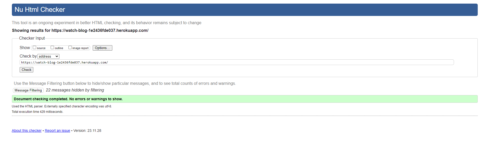
                   |  PASS  |
| Blog Post| 

Blog Post

                   |  PASS  |
| Login    | 

Login

                         |  PASS  |
| Logout   | 

Logout
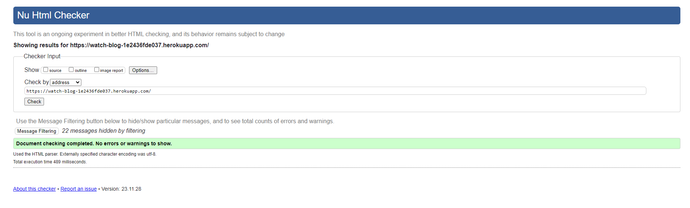
                  |  PASS  |
| Create   | 

Create
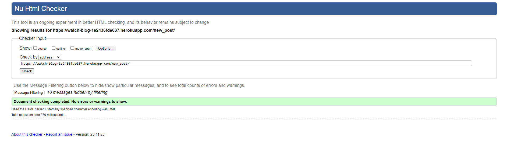
            |  PASS  |
| Contact  | 

Contact

          |  PASS  |
| Register | 

Register
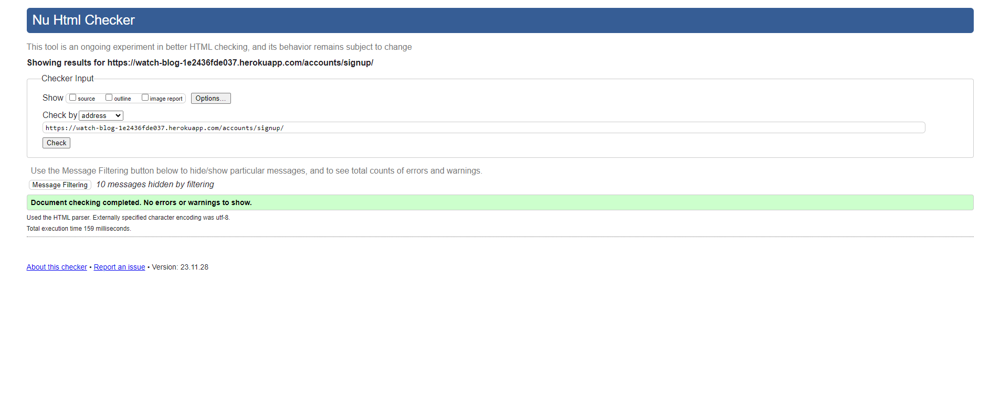
            |  PASS  |

W3C Validator Images

### CSS

Validator: [Jigsaw Validator](https://jigsaw.w3.org/css-validator/validator).

CSS Validation Image

No errors or warnings to show for during the CSS Validator testing.

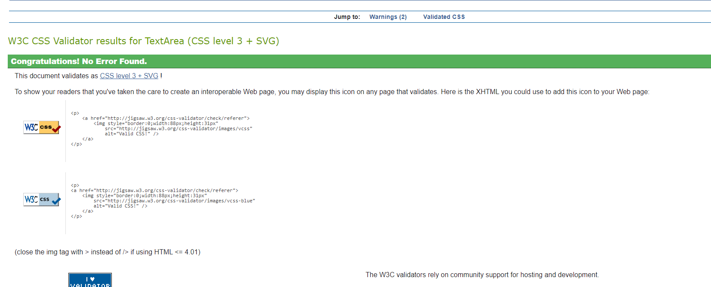

### JavaScript

Validator: [JSHint Validator](https://jshint.com/).

JS Validation Image

JSHint quality tool has been used to test the code, without finding any errros or warnings. THere is 1 underfined variable warning reported, were due to bootstrap.

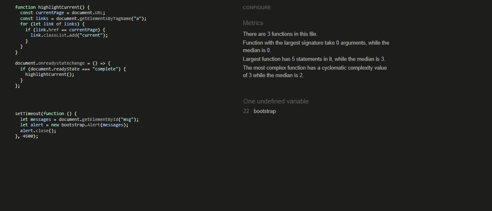

### Python

Validator: [CI Python Linter](https://pep8ci.herokuapp.com/).

| File     | Validator                                                                                         | Result |
| -------- | ------------------------------------------------------------------------------------------------- | ------ |
| Models   | 

Models

      |  PASS  |
| Views    | 

Views
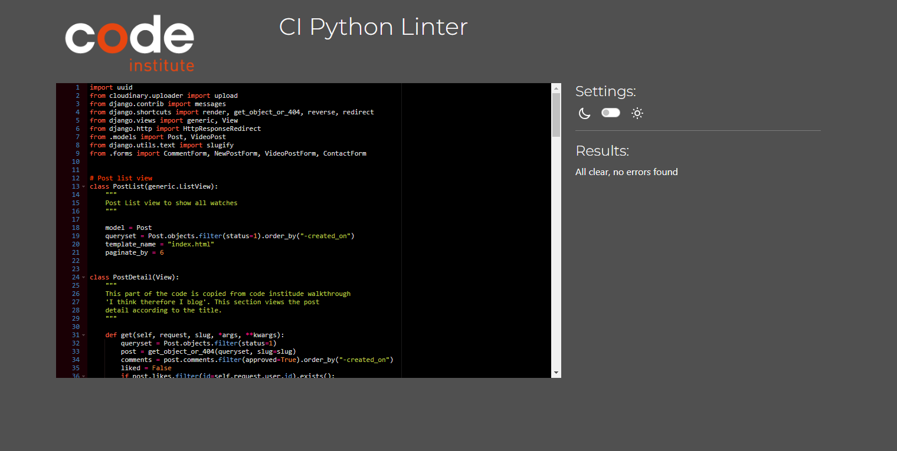
       |  PASS  |
| Forms    | 

Forms
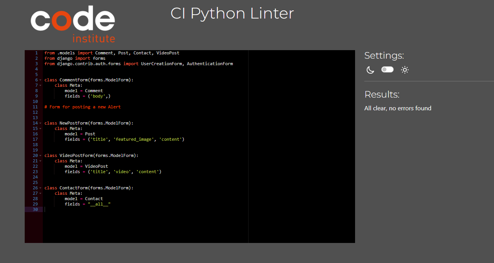
       |  PASS  |
| Urls     | 

URLs
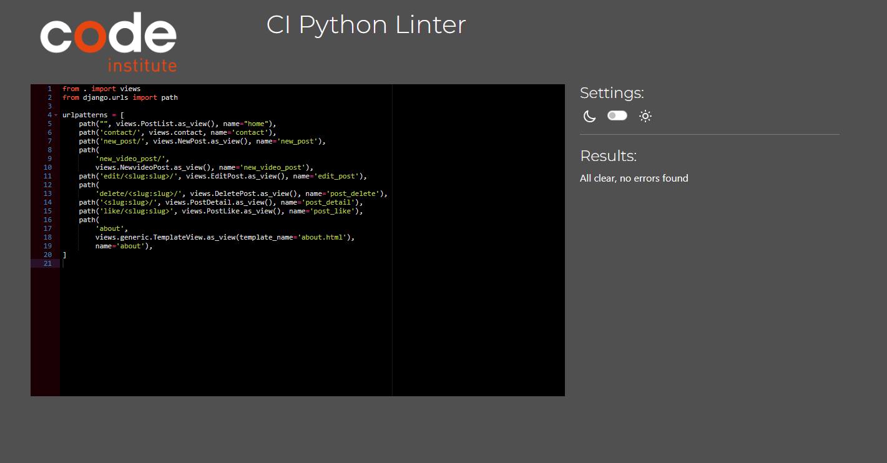
           |  PASS  |
| Admin    | 

Admin

       |  PASS  |
| Settings | 

Settings

 |  PASS  |

Settings py validation errors of line to long are from the original django configuration set up and are left for readability.

# Manual Testing

**User Registered**

- There are some features that are only visible when the user is logged in.
- User can create a post.
- User can edit their own post they created.
- User can leave a comment.
- User can delete their own post they created
  
**User Not Registered**

- If there is no user logged in, the home page won't show Crate a post.
- The user will be able to see a post entry but won't be able to add a comment.
- The user isn't able to edit or deleted a post unless it's a post that the user has created.

Login and Not Logged in Page

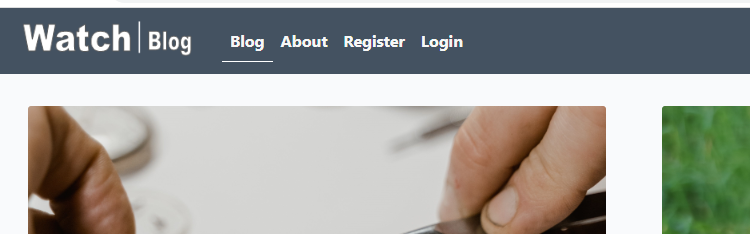

**User Registered**

- If a user is registered, they will be able to create a post.
- If the user has created a post, that user will be able to edit and deleted their own post.
- If the user isn't the creator of the post the user can't edit or deleted the post, only add comments.
- Alert messages appear when a use has logged in, logged out, a comment added, a post is edited and a when a post is deleted.

**Image display**

- Code was added to the default image in index.html and alt text appear instead of the image. There is a comparison in the image below.

Image error

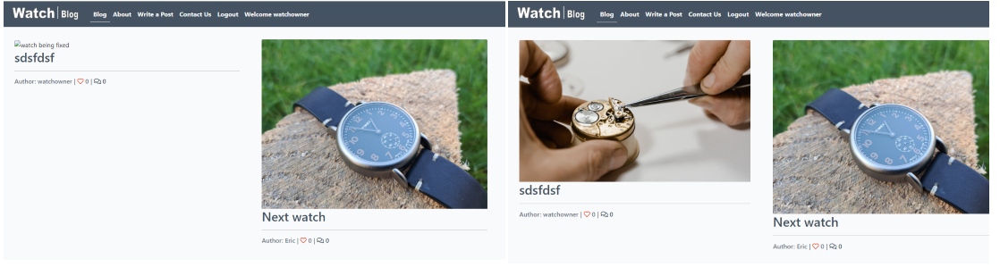

## Checks Completed

- The following check have been completed
  
|Test|       Action                             |   Result                                                                  |Done   |
|----|------------------------------------------|---------------------------------------------------------------------------|-------|
| 1  |  Login is Clicked                        |  Redirected to login page                                                 | PASS  |
| 2  |  Watch Blog logo clicked on about page   |  Redirected to home page                                                  | PASS  |
| 3  |  Register is Clicked	                    |  Redirected to Sign up page                                               | PASS  |
| 4  |  Login is Clicked	                    |  Signed in and redirected to Blog home page                               | PASS  |
| 5  |  Logout is clicked 	                    |  Redirected to Sign out page, sign out clicked, and sign out              | PASS  |
| 6  |  Home page clicked post entry	        |  Directed to post entry.                                                  | PASS  |
| 7  |  Bolg Post edit/delete post	            |  

Not correct user, can't edit or delete post

                              | PASS  |
| 8  |  Create a Post	                        |  Redirected to create a post page                                         | PASS  |
| 9  |  Create a Post page	                    |  No title entered, post button clicked, error field appears               | PASS  |
| 10 |  Create a Post page	                    |  No Content entered, post button clicked, error field appears             | PASS  |
| 11 |  Create a Post page	                    |  No image entered, post button clicked, default image  appears in blog    | PASS  |
| 12 |  Bolg Post edit, creator	                |  

Edit button visible

                                                      | PASS  |
| 13 |  Bolg Post delete, creator	            |  

Delete button visible

                                                    | PASS  |
| 14 |  Delete button clicked	                |  Confirmation button appears                                              | PASS  |
| 15 |  Blog home page, comment icon clicked.	|  Redirect to blog post                                                    | PASS  |
| 16 |  Comment icon	                        |  Correct number on blog page and home page                                | PASS  |
| 17 |  Like heart button clicked on blog page	|  Increments number by 1                                                   | PASS  |
| 18 |  heart icon	                            |  Correct number on blog page and home page                                | PASS  |
| 19 |  Footer, clicking facebook icon	        |  

Redirected to Facebook

                                                   | PASS  |
| 20 |  Footer, clicking Twitter (x) icon	    |  

Redirected to Twitter

                                                | PASS  |
| 21 |  Footer, clicking GitHub icon	        |  

Redirected to GitHub

                                                     | PASS  |
| 22 |  Footer, clicking Instagram icon	        |  

Redirected to Instagram

                                                  | PASS  |
| 23 |  Footer, clicking YouTube icon	        |  

Redirected to YouTube

                                                 | PASS  |
| 24 |  Message alert for Signed in	            |  

Alert Appears

                                                            | PASS  |
| 25 |  Message alert for Signed out	        |  

Alert Appears

                                                            | PASS  |
| 26 |  Message alert for post edited	        |  

Alert Appears

                                                            | PASS  |
| 27 |  Message alert for post deleted	        |  

Alert Appears

                                                            | PASS  |
| 28 |  Message alert for comment added	        |  

Alert Appears

                                                            | PASS  |
| 29 |  Next and Prev buttons	                |  Direct to next and Previous pages                                         | PASS  |

|Test|     Post Detail Page                     |   Result                                                                  |Done   |
|----|------------------------------------------|---------------------------------------------------------------------------|-------|
| 1  |  Edit button                             | Visible for authenticated user of post                                    | PASS  |
| 2  |  Edit button                             | Isn't Visible for unauthenticated user of post                            | PASS  |
| 3  |  Deleted button	                        | Visible for authenticated user of post                                    | PASS  |
| 4  |  Deleted button	                        | Isn't Visible for unauthenticated user of post                            | PASS  |
| 5  |  Add comment button 	                    | Visible for authenticated user of the site                                | PASS  |

|Test|     Sign Up page                         |   Result                                                                  |Done   |
|----|------------------------------------------|---------------------------------------------------------------------------|-------|
| 1  |  Valid info, submitted                   | Redirected to blog                                                        | PASS  |
| 2  |  Invalid info, submitted                 | Error message appears                                                     | PASS  |
| 3  |  Sign Up button	                        | Hover over, colour changes                                                | PASS  |
| 4  |  Sign Up button clicked	                | Signed up and redirected to Blog home page                                | PASS  |

|Test|     Contact Page                         |   Result                                                                  |Done   |
|----|------------------------------------------|---------------------------------------------------------------------------|-------|
| 1  |  Submit button                          | Hover over, colour changes                                                | PASS  |
| 2  |  Submit button clicked                  | Message sends, Alert message appears                                      | PASS  |
| 3  |  Submit button clicked                  | Django admin app is updated with contact name, email and message          | PASS  |

|Test|     Logout Page                          |   Result                                                                  |Done   |
|----|------------------------------------------|---------------------------------------------------------------------------|-------|
| 1  |  Sign Out button                         | Hover over, colour changes                                                | PASS  |
| 2  |  Sign Up button clicked                  | Redirected to Blog home page, Alert message appears                       | PASS  |

|Test|     Logout Page                          |   Result                                                                  |Done   |
|----|------------------------------------------|---------------------------------------------------------------------------|-------|
| 1  |  Sign In button                          | Hover over, colour changes                                                | PASS  |
| 2  |  Sign Up link clicked                    | Redirected to Sign Up page                                                | PASS  |
| 3  |  Invalid Username/Password	            | Asked to enter correct username                                           | PASS  |

|Test|     Create Post Page                     |   Result                                                                  |Done   |
|----|------------------------------------------|---------------------------------------------------------------------------|-------|
| 1  |  Link to Go Back pressed                 | Redirected to Blog/Home page                                              | PASS  |
| 2  |  Link to Go Back pressed                 | Redirected to Blog/Home page                                              | PASS  |

|Test|     404 Error   Page                     |   Result                                                                  |Done   |
|----|------------------------------------------|---------------------------------------------------------------------------|-------|
| 1 |  Incorrect page entered for 404 error	    |  

404 error page

                                                | PASS  |

## WAVE

- I used [WAVE](https://wave.webaim.org/)  (Web Accessibility Evaluation Tool) in chrome developer tools to test the website accessibility. WAVE is a tool that identifies ways to make a webpage more accessible to people with disabilities. WAVE scans the website for on-page and technical accessibility issues and errors to bring the site in line with recognized accessibility standards, like the Web Content Accessibility Guidelines (WCAG).

Wave Testing Image

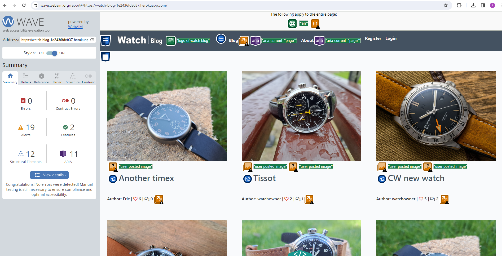

## Lighthouse

- Lighthouse in chrome developer tool, was used to test the website for:
- Performance - how the page performs whilst loading.
- Accessibility - how accessible is the site for all users and how can it be improved.
- Best practices - how does the site conform to industry best practices.
- SEO - search engine optimization. Is the site optimized for search engine result rankings.

Lighthouse Testing Image

- Performance is down to the images and their size.
- Best Practices  [Lighthouse](https://developer.chrome.com/docs/lighthouse/pwa/is-on-https)

# Automated Testing

- Some code was written for automated testing, more research and learning needs to go into this so I can learn how to code the tests and improve the auto testing function.

# Browsers compatibility

The website has been tested in the following browsers on desktop:

Chrome Test 

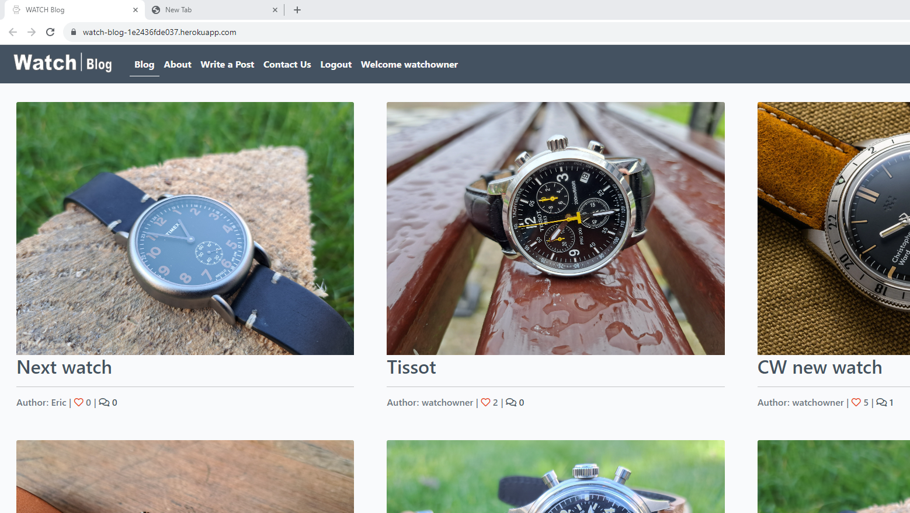

Fire Fox Test 

Edge Test 

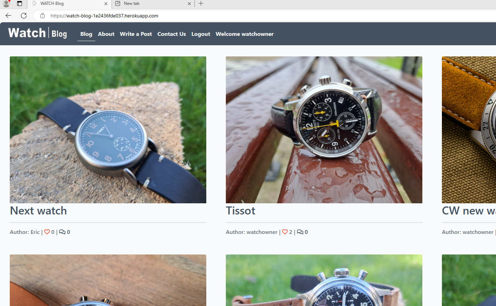

